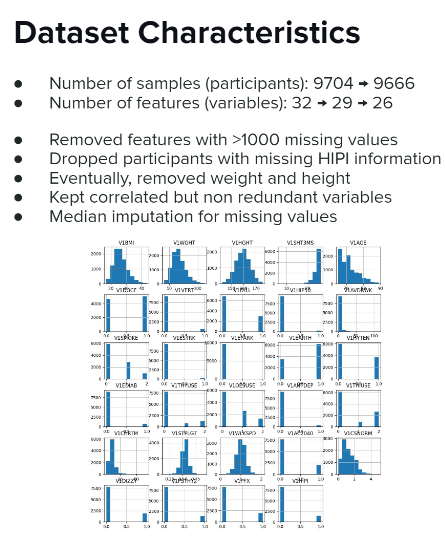

# Osteoporotic fracture prediction and risk variable selection

## Repository Link

[https://github.com/denisebock/osteoporotic-fractures]

## Description

Based on data from the Study of Osteoporosis (SOF) Dataset, we wanted to predict hip fractures in elderly women based on multiple features. In addition, we wanted to select the most important features for predicting hip fractures.

### Task Type

Regression / Classification

### Results Summary

- **Best Model:** A 'best' model could not be specified as all models performed roughly the same, and had substandard performance.
- **Evaluation Metric:** Accuracy, Specificity, Sensitivity
- **Result:** weak performance for all models
              **Model 1**	Logistic Regression, undersampled, top 10	| 0.48 - accuracy,	0.45 - specificity,	0.64 - sensitivity
              **Model 2**	Random Forest, undersampled, top 10 |	0.40 - accuracy,	0.35 - specificity,	0.69 - sensitivity
              **Model 3**	Neural Network, undersampled, top 10 | 0.39 - accuracy,	0.34 - specificity,	0.70 - sensitivity
- **Conclusion:** while variables like age and previous vertebral fractures are very important for fracture prediction, they are not sufficient. Variables like bone mineral density and ideally, radiological images are key for effective prediction of osteoporotic fractures.

## Documentation

1. **[Literature Review](0_LiteratureReview/README.md)**
2. **[Dataset Characteristics](1_DatasetCharacteristics/exploratory_data_analysis.ipynb)**
3. **[Baseline Model](2_BaselineModel/baseline_model.ipynb)**
4. **[Model Definition and Evaluation](3_Model/model_definition_evaluation.ipynb)**
5. **[Presentation](4_Presentation/README.md)**

## Cover Image

